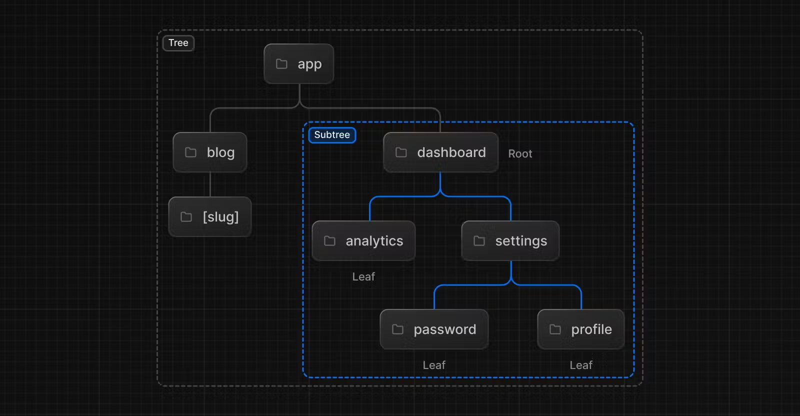
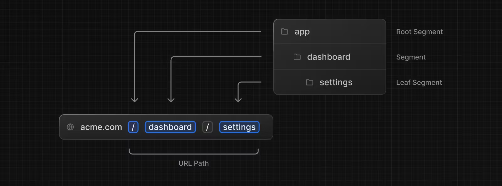
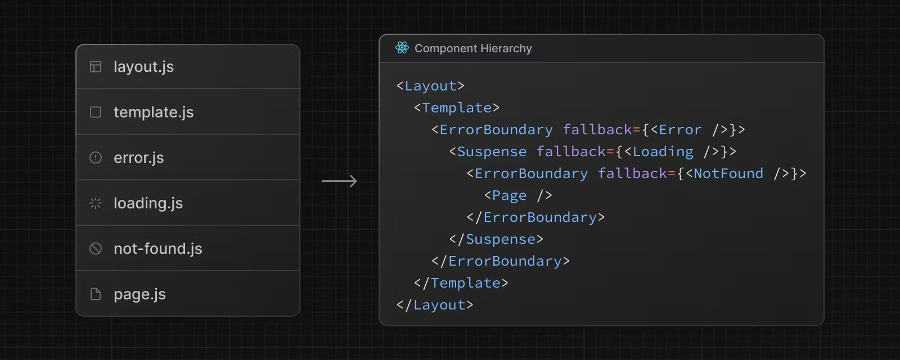
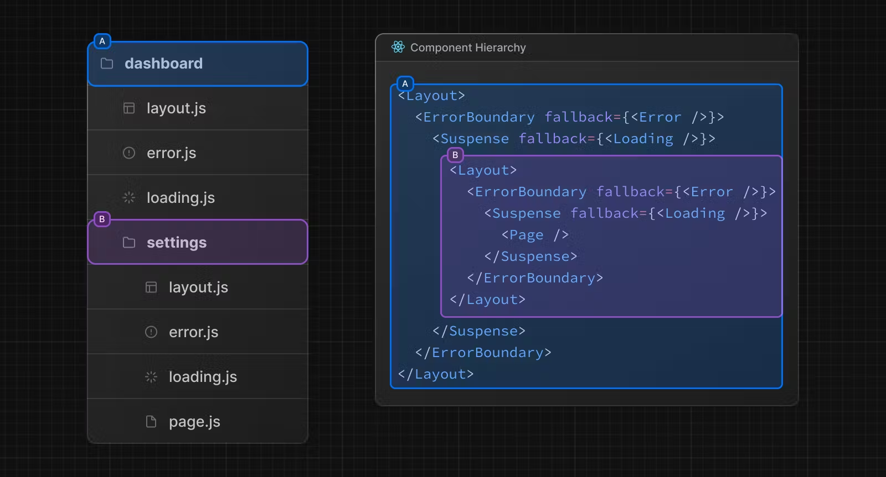
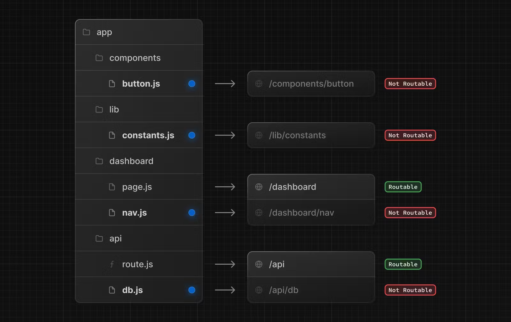

# Routing Fundamentals

모든 애플리케이션의 뼈대는 라우팅이다. 이 페이지는 우리에게 웹 라우팅을 위한 기본 개념과 Next.js에서는 어떻게 핸들링 되는지 알려줍니다.

## Terminology

처음 우리는 이 문서를 통해 많은 용어들을 볼 수 있을 거에요.


- Tree: 계층 구조를 시각화하기 위한 컨벤션
- SubTree: 트리의 부분, 새로운 루트와 리프로 구성됨
- Root: 트리 혹은 서브트리의 첫 노드 (루트의 레이아웃과 같음)
- Leaf: 자식이 없는 서브트리의 노드들 (URL 경로의 마지막 세그먼트)


- URL Segment: `/`로 나눠지는 URL을 구성하는 부분
- URL Path: 도메인 뒤에 오는 URL의 부분

## The `app` Router

버전 13에서 Next.js는 리액트 서버 컴포넌트들로 만들어진 새로운 **App Router**를 소개했습니다.
이는 공유된 레이아웃들과 계층화된 라우팅, 상태 로딩, 에러 헨들링 등 많은 것들을 제공합니다.

앱 라우터는 `app`이라는 새로운 디렉토리 안에서 동작합니다. 이 `app` 디렉토리는 점진적인 적용을 위해서 `pages`와 나란히 동작합니다.
이 것은 우리가 어떤 루트는 여전히 `pages` 내에서 동작하게 하고, 새로운 루트는 `app`에서 동작할 수 있도록 하여, 점진적인 리펙토링을 지원합니다.
만약에 `pages` 디렉토리를 사용하고 싶으면, [Pages Router](https://nextjs.org/docs/pages/building-your-application/routing)를
참고하세요

```
** Good to know **
앱 라우터는 페이지 라우터보다 우선적으로 동작합니다. 
디렉토리 간 루트는 동일한 URL 경로를 가질 수 없으며, 충돌 방지를 위해서 빌드 시간 오류가 발생합니다.
```


기본적으로 `app` 내부의 컴포넌트들은 react server components로 이루어져 있습니다.
이 것은 성능 최적화 되어있으며, 쉽게 그것들을 적용할 수 있도록 해줍니다. 다만 Client Component도 사용할 수 있습니다.

각 컴포넌트가 어떤 것인지 모른다면, [Server and Client Component](https://nextjs.org/docs/getting-started/react-essentials)를 읽어보세요
---

## Roles of Folders and Files

Next.js는 라우터 기반의 파일 시스템을 사용합니다.

- Folder: 루트를 정의하기위해 사용됩니다. 한 루트는 중첩된 폴더의 단일 경로를 말합니다. 이는 루트에서 끝 리프 폴더까지의 `page.js` 파일 시스템 계층을 포함합니다.
- File: 파일은 루트 세그먼트를 위해 보여지는 UI를 만들기 위해 사용됩니다.

## Route Segments

하나의 루트 안에 각 폴더는 루트 세그먼트입니다. 각 루트 세그먼트는 URL path에 세그먼트들과 일치하도록 매핑됩니다.


## Nested Routes

중첩된 루트를 만들기 위해서, 우리는 폴더를 중첩시킬 수 있습니다.
예를 들어, 우리는 `/dashboard/settings`를 `app` 디렉토리에 새로운 루트를 추가할 수 있습니다.

위 루트는 아래와 같이 세가지 세그먼트로 구성됩니다:

- `/` (Root Segement)
- `dashboard` (Segment)
- `settings` (Leaf Segment)

## File Convensions

Next.js는 특정 역할을 위한 UI를 만들기 위해 특별한 파일 세트를 제공합니다.

| Filename     | Description                                                      |
|--------------|------------------------------------------------------------------|
| layout       | 하위 세그먼트들의 공유 UI를 제공 <br/> (루트는 필수지만, 자식들에게 Layout이 없을 경우 부모를 따름) |
| page         | 한 루트의 유일한 UI, 공개적으로 접근 가능한 루트를 만든다                               |
| loading      | 로딩 UI                                                            |
| not-found    | 404 page UI                                                      |
| error        | error UI                                                         |
| global-error | 글로벌 에러 UI                                                        |
| route        | 서버 사이드 API 엔드포인트                                                 |
| template     | 특수 재 렌더링 된 레이아웃 UI                                               |
| default      | parallel Routes를 위한 fallback UI                                  |

---
## Component Hierarchy
리액트 컴포넌트들은 루트 세그먼트의 특별한 파일들로 정의됩니다.
- layout
- template
- error
- loading
- not-found
- page


중첩된 루트에서는 세그먼트의 컴포넌트 들이 부모 세그먼트의 컴포넌트 안으로 중첩될 것입니다. 


## Colocation
우리는 `page.js` 혹은 `route.js`를 가진 폴더들만 루트로 매핑되기 때문에, `app` 디렉토리안에 다른 목적을 가진 특별한 컴포넌트 들을 추가할 수 있습니다. 
예를 들어, 버튼 컴포넌트, 상수값...등

