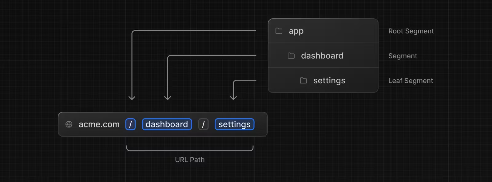
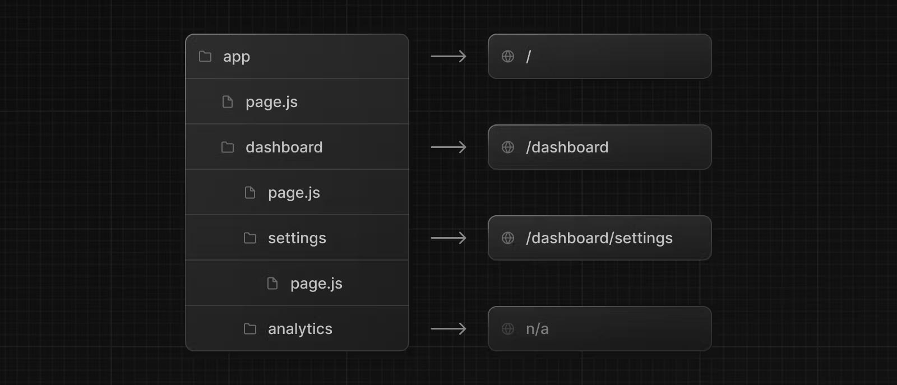

###### *이 문서는 공식페이지 기준으로 정리했습니다.

## 루트 정의
이 페이지는 우리에게 Next.js 애플리케이션에서 어떻게 루트를 만들고 정의하는 지에 대해서 가이드를 줄 것입니다.

### Creating Routes

Next.js는 파일 시스템 기반 라우팅을 사용합니다. 따라서 각 폴더들은 루트를 정의하는데 사용됩니다. 

각 폴더는 URL 세그먼트와 매핑되는 루트 세그먼트를 가리킵니다. 중첩된 루트를 만들기 위해서는, 폴더를 중첩시킬 수도 있습니다. 



특별한 `page.js` 파일은 루트 세그먼트를 공개 접근이 가능하도록 만들어줍니다.


예를 들어, `/dashboard/analytics` URL 경로는 `page.js`가 없기 때문에 공개적으로 접근할 수 없습니다. 
이 폴더는 컴포넌트들, 스타일, 이미지, 다른 다양한 파일들을 위치하는데 사용됩니다.

> Good to know: `.js`, `.jsx` or `.tsx` 파일 익스텐션들도 특별한 파일로 사용될 수 있습니다.
편의상 문서에서는 `.js`로 설명합니다.

---

### Creating UI

[특별한 파일 규약들](00_doc_routing_fundamentals.md)은 각 루트 세그먼트를 위한 UI를 만드는데 사용됩니다. 
가장 일반적인 페이지들은 `pages`, `layouts` 입니다. 
`pages`는 유일한 루트를 위한 UI를 나타내고, `layouts`는 하위 루트들에 대한 공통 UI를 나타냅니다.

예를 들어, 우리가 첫 페이지를 만들고 싶으면, `page.js`를 `app` 디렉토리에 추가하고, 리액트 컴포넌트를 노출할 겁니다. 
```javascript
export default function Page() {
    return <h1> Hello, Next.js!</h1>
}
```