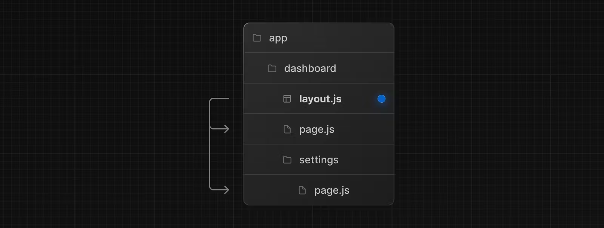
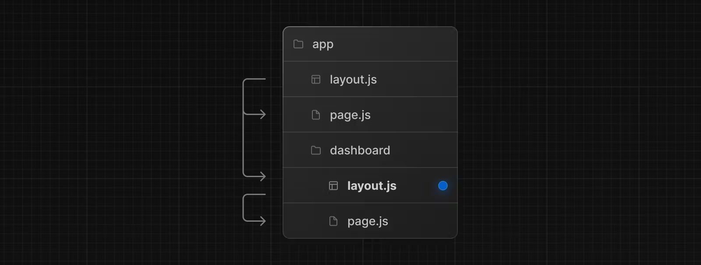
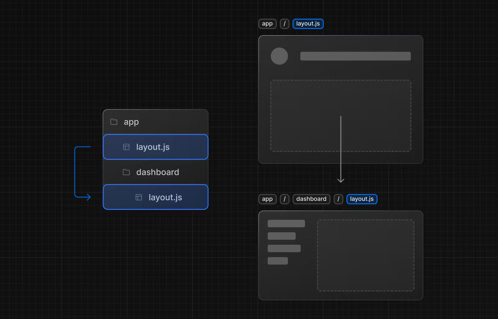

# Pages and Layouts

이 전에 Next.js 13에서 앱 라우터는 쉽게 페이지, 공통 레이아웃, 템플릿을 만드는 새로운 파일 규약이라고 소개했습니다.
이 페이지는 우리에게 Next.js 애플리케이션에서 특별한 파일들을 어떻게 사용하는지 가이드를 줄 겁니다. 

---

# Pages

`page`는 루트의 고유한 UI입니다. 우리는 `page.js` 파일에서 컴포넌트를 노출하여 페이지들을 정의할 수 있습니다.
루트를 정의하기 위해 중첩된 폴더들을 사용하고 `page.js` 파일로 루트를 공개접근 가능하도록 만들 수 있습니다. 

```javascript
// `app/page.tsx` is the UI for the `/` URL
export default function Page() {
  return <h1>Hello, Home page!</h1>
}
```

```javascript
// `app/dashboard/page.tsx` is the UI for the `/dashboard` URL
export default function Page() {
  return <h1>Hello, Dashboard Page!</h1>
}
```

> Good to know: 
> - 한 페이지는 항상 루트의 서브트리의 `leaf`입니다!
> - `.js`, `.jsx`, `.tsx` 파일 모두 페이지로 사용가능합니다.
> - `page.js` 파일은 루트 세그먼트를 공개적으로 사용가능하도록 만들어줍니다.
> - 페이지들은 기본적으로 서버 컴포넌트로 되어있지만, 클라이언트 컴포넌트로 만들 수 있습니다. 
> - 페이지들은 데이터를 가져올 수 있습니다. 

---

# Layouts

레이아웃은 여러 페이지들의 공통 UI를 정의하는데 사용됩니다. 
네비게이션에서, 레이아웃들은 상태를 보존하고, 상호작용들을 유지하며, 다시금 렌더링을 하지 않습니다. 

우리는 `layout.js`에서 리액트 컴포넌트를 익스포팅하여 레이아웃을 정의할 수 있습니다.


```javascript
export default function DashboardLayout({
  children, // will be a page or nested layout
}: {
  children: React.ReactNode
}) {
  return (
    <section>
      {/* Include shared UI here e.g. a header or sidebar */}
      <nav></nav>
 
      {children}
    </section>
  )
}
```

> Good to know:
> - 최상단의 레이아웃을 우리는 루트 레이아웃이라고 부릅니다. 이것은 필수적으로 필요한 요소로서, 애플리케이션에서 모든 페이지들의 기본이 됩니다. 따라서 반드시 `html` 과 `body` 태그를 가지고 있어야합니다.
> - 어떠한 루트 세그먼트는 *선택적*으로 자기 자신의 레이아웃을 가질 수 있습니다. (최상단 루트 레이아웃을 참조할 수 있기 때문)
> - 레이아웃들은 기본적으로 중첩되어있습니다. 각 부모 레이아웃은 자식 레이아웃을 감싸고 있습니다.
> - 우리는 루트 그룹을 사용해서 특정 루트 세그먼트를 택할 수 있습니다.
> - 레이아웃들은 기본적으로 서버 컴포넌트로 구성되어있지만 이 역시 클라이언트 컴포넌트로 사용할 수 있습니다. 
> - 레이아웃도 데이터를 가져올 수 있습니다. 
> - 부모 레이아웃과 자식 레이아웃 사이에 데이터 전달은 불가능합니다. 그러나, 우리는 특정 루트에서 같은 데이터를 여러 번 가져올 수 있고, 리액트에서는 자동적으로 성능에 영향을 주지 않고 중복요청을 제거합니다.
> - 레이아웃은 현재 루트 세그먼트로 액세스 할 수 없습니다. 루트 세그먼트로 접근하기 위해서 우리는 클라이언트 컴포넌트의 `useSelectionLayoutSegment` 혹은 `useSelectedLayoutSegments`를 사용할 수 있습니다.

---

# Root Layout (Required)

루트 레이아웃은 `app` 디렉토리 최상단에서 정의됩니다. 이는 모든 루트에 적용됩니다. 이 레이아웃을 사용하면 서버에서 반환된 초기 HTML을 수정할 수 있습니다. 
```javascript
export default function RootLayout({
  children,
}: {
  children: React.ReactNode
}) {
  return (
    <html lang="en">
      <body>{children}</body>
    </html>
  )
}
```

> Good to know:
> - `app` 디렉토리는 반드시 루트 레이아웃을 포함시켜야 합니다.
> - 루트 레이아웃에는 반드시 `<html>` `<body>` 태그가 정의되어야 합니다. Next.js에서는 자동적으로 해주지 않습니다.
> - 우리는 [built-in SEO support](https://nextjs.org/docs/app/building-your-application/optimizing/metadata)를 통해 `<head>`를 관리할 수 있습니다.
> - 우리는 루트 그룹들을 사용하여 여러개 루트 레이아웃을 만들 수 있습니다. 

# Nesting Layouts

레이아웃은 특정한 루트 세그먼트에 적용할 폴더 안에 정의되고 그 세그먼트가 활성화될 때 렌더링합니다.
기본적으로, 파일 계층에 있는 레이아웃들은 중첩되어있고, 이 것은 자식 레이아웃들을 감사는 것을 의미합니다.


```javascript
export default function DashboardLayout({
  children,
}: {
  children: React.ReactNode
}) {
  return <section>{children}</section>
}
```

> Good to know:
> - 오직 루트 레이아웃만 `<html>` `<body>` 태그를 가질 수 있습니다!

만약 두 개 이상의 레이아웃들을 결합한다면, 루트 레이아웃(`app/layout.js`)는 대시보드 레이아웃(`app/dashboard/layout.js`)을 감살 것입니다.
그리고 `app/dashboard/*` 하위의 레이아웃 역시 대시보드 레이아웃에 감싸질 것입니다.



---

# Templates

템플릿은 그들이 자식 레이아웃 혹은 페이지를 감싸는 것에서 레이아웃과 유사합니다. 
루트들을 지속하고 상태를 유지하는 레이아웃과는 다르게, 템플릿은 네비게이션에서 그들의 자식을 위해 새로운 인스턴스를 만듭니다. 
이 것은 유저가 템플릿을 공유한 루트들을 방문할 때에, 새로운 컴포넌트가 마운트되는 것을 위미합니다. 
DOM 객체가 새로 생성되고, 상태가 보존되지 않고, 효과 역시 재 동기화되는 것을 말합니다.

우리는 특정 동작을 필요로 하는 몇가지 케이스들이 있을 겁니다. 이 경우, 템플릿은 레이아웃보다 더 적합할 것입니다.

예시)
- 애니메이션 라이브러리 혹은 css를 사용한 애니메이션을 추가하거나 나갈때
- `useState`(피드백 폼 같은) 혹은 `useEffect`(로깅 페이지뷰와 같은)에 의존한 동작들 
- 기본적인 프레임워크 동작을 바꾸고 싶을 때. 예를 들어, 